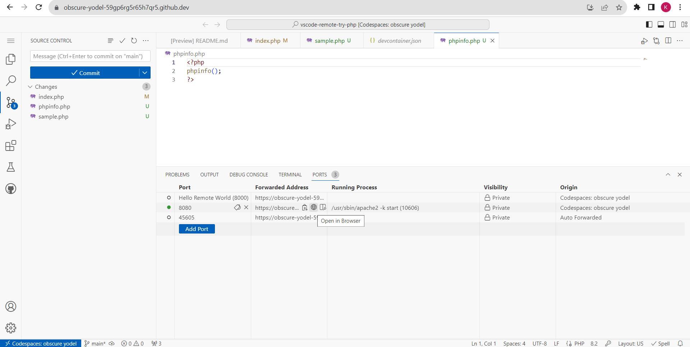

# PHP Development Environment Setup

Welcome to your PHP development environment! This repository is set up to allow you to work with PHP in a GitHub Codespace. Follow the instructions below to get started with adding more PHP files and viewing their output in your browser.

## Adding More PHP Files

1. **Create New PHP Files**:
   - In the GitHub Codespace, create new PHP files by clicking on the `New File` icon in the Explorer tab on the left-hand side.
   - Name your file with a `.php` extension (e.g., `example.php`) and write your PHP code in the file.

2. **Save Your Files**:
   - Save your PHP files by pressing `Ctrl + S` (or `Cmd + S` on macOS).

## Viewing Output in Browser

### Start Apache Web Server:
1. Open the terminal in your Codespace (you can use the `Terminal` menu at the top or press `` Ctrl + ` ``).
2. Type the following command to start the Apache web server:

```bash
apache2ctl start
```

### Access Your PHP Files:
1. In the Codespace, navigate to the "Ports" section.
2. Hover your mouse pointer over the "Forwarded Address" column corresponding to the "8080" port.
3. Click on the "Open In Browser" option. This will open a new browser tab.

4. In the address bar of the new browser tab, the URL you see corresponds to the `localhost:8080` equivalent in your Codespace environment.
5. 6. To access other PHP files you have created, append the filename to the URL in the address bar.
   - Example: If your PHP file is named `hello.php`, modify the URL in the address bar to:
     ```plaintext
     https://obscure-yodel-59gp6rg5r65h7qr5-8080.app.github.dev/hello.php
     ```

## Note

- Commissioning your PHP Codespace might take a few minutes. Please be patient as the environment is being set up.

---

This content should provide a clear and comprehensive guide for your students to follow in order to create new PHP files, start the Apache web server, and access the output of their PHP files in a browser within the GitHub Codespace environment.
